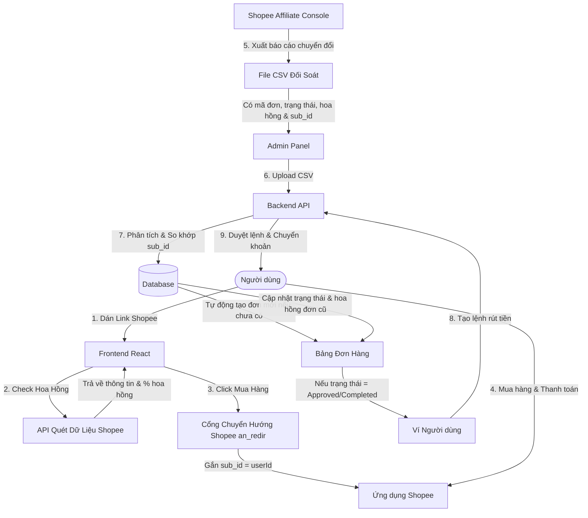

# 🛍️ Shopee Cashback Affiliate - Hệ Thống Hoàn Tiền Mua Sắm

Hệ thống hoàn tiền mua sắm tự động liên kết với nền tảng **Shopee Affiliate Program**. Người dùng chỉ cần dán link sản phẩm Shopee muốn mua, hệ thống sẽ kiểm tra tiền hoa hồng dự kiến, chuyển đổi thành link Affiliate độc quyền chứa mã định danh người dùng (`sub_id`). 

Do không cần/không có API chính thức từ Shopee để đồng bộ đơn hàng tự động, **toàn bộ dữ liệu đơn hàng và trạng thái hoàn tiền trên hệ thống sẽ được khởi tạo và đối soát định kỳ thông qua file CSV xuất từ Shopee Affiliate Console**.

---

## 🗺️ Luồng hoạt động hệ thống (System Data Flow)

---

## 📊 Cơ chế đồng bộ & đối soát đơn hàng qua file CSV

Do đặc thù Shopee Affiliate không cung cấp API đồng bộ giao dịch thời gian thực cho các nhà phát triển cá nhân, hệ thống sử dụng cơ chế **đối soát file CSV định kỳ (hàng ngày/hàng tuần)** làm nguồn dữ liệu duy nhất để quản lý đơn hàng và số dư ví của khách hàng.

### 1. Nguyên lý hoạt động
1.  **Lưu Click Log (Không tạo đơn trước):** Khi khách hàng click vào link hoàn tiền từ web của bạn, backend chỉ ghi nhận một bản ghi Click Log (gồm: `userId`, `time`, `targetUrl`). Lúc này **chưa có đơn hàng nào được tạo** trong bảng `orders` của database vì chưa biết khách có mua thật hay không.
2.  **Ghi nhận Sub ID:** Khi chuyển hướng sang Shopee, hệ thống truyền ID của user vào tham số `sub_id` (ví dụ: `sub_id=USR101`). Shopee sẽ lưu mã này kèm theo giao dịch mua hàng.
3.  **Xuất báo cáo Shopee:** Admin truy cập *Shopee Affiliate Console* -> *Báo cáo chuyển đổi (Conversion Report)* -> chọn khoảng thời gian cần đối soát và xuất file CSV.
4.  **Tải file lên hệ thống:** Admin upload file CSV này lên trang quản trị. Backend sẽ duyệt qua từng dòng dữ liệu:
    *   **Trích xuất Sub ID (Mã User):** Hệ thống tìm cột `Sub ID 1` (chứa `userId` ví dụ `USR101`). Nếu dòng nào không có `Sub ID` hoặc `Sub ID` không khớp với user nào trong hệ thống, hệ thống sẽ bỏ qua hoặc log lại.
    *   **Tạo mới đơn hàng (Insert):** Nếu mã đơn hàng Shopee (`order_id`) trong file CSV **chưa tồn tại** trong database, hệ thống sẽ tự động thêm mới đơn hàng đó vào bảng `orders`, gán cho người dùng tương ứng với `Sub ID`, lưu thông tin tên sản phẩm, giá trị đơn, hoa hồng và trạng thái mua hàng hiện tại.
    *   **Cập nhật đơn hàng (Update):** Nếu mã đơn hàng **đã tồn tại** (do các phiên đối soát trước đã import ở trạng thái Chờ), hệ thống sẽ cập nhật trạng thái mới nhất (ví dụ: từ *Chờ đối soát* sang *Đã duyệt* hoặc *Bị hủy*) và cập nhật lại số tiền hoa hồng thực tế nhận từ Shopee.
    *   **Kết chuyển số dư ví:** Khi một đơn hàng chuyển sang trạng thái duyệt thành công (`approved` hoặc `completed`), backend tự động tính tiền hoàn cho khách hàng (ví dụ: $50\% \times \text{hoa hồng thực nhận}$) và cộng số dư khả dụng vào ví của người dùng.

### 2. Cấu trúc các cột tối thiểu trong file CSV Shopee cần đọc
File CSV tải từ Shopee Console cần đảm bảo chứa các cột dữ liệu quan trọng sau để Backend có thể map tự động (có thể cấu hình map tên cột trong code):

| Tên Cột Trên Shopee (Ví dụ) | Kiểu Dữ Liệu | Mô Tả & Tác Vụ Backend |
| :--- | :--- | :--- |
| `Order ID` hoặc `Mã đơn hàng` | VARCHAR | Mã đơn duy nhất của Shopee. Dùng làm **Khóa chính** bảng `orders` để tránh trùng lặp. |
| `Sub ID 1` hoặc `Mã định danh` | VARCHAR | Chứa `userId` của hệ thống (VD: `USR101`) dùng để liên kết đơn với khách hàng. |
| `Purchase Time` hoặc `Thời gian mua` | DATETIME | Thời gian khách đặt đơn hàng trên Shopee. |
| `Item Name` hoặc `Tên sản phẩm` | VARCHAR | Tên sản phẩm chính để hiển thị lịch sử mua hàng cho user. |
| `Item Image` hoặc `Ảnh sản phẩm` | VARCHAR | Link ảnh sản phẩm (nếu có trong báo cáo) hoặc dùng ảnh mặc định. |
| `Order Value` hoặc `Giá trị đơn hàng` | DECIMAL | Giá tiền thực tế khách thanh toán trên đơn hàng. |
| `Estimated Commission` hoặc `Hoa hồng` | DECIMAL | Tổng tiền hoa hồng Shopee trả cho đơn hàng này. |
| `Order Status` hoặc `Trạng thái đơn` | VARCHAR | Trạng thái đơn của Shopee: *Chờ xử lý (Pending)*, *Hoàn thành (Completed)*, *Đã hủy (Cancelled)*. |

---

## 🌟 Các chức năng hiện tại (Frontend Features)

### 1. Phía Người Dùng (Client Side)
*   **Trang chủ (Landing Page):**
    *   Tìm kiếm và kiểm tra tiền hoa hồng dự kiến bằng link gốc sản phẩm Shopee thông qua API quét thông tin sản phẩm trung gian.
    *   Tạo link hoàn tiền nhanh bằng cách gắn ID người dùng đang đăng nhập làm Sub ID để theo dõi vết đơn hàng.
    *   Tải nhanh danh sách sản phẩm mẫu để người dùng thử nghiệm tính năng nhanh chóng.
*   **Lịch sử tích lũy (Tracking Page):**
    *   Thống kê số lượng đơn, tổng tiền đơn mua, số tiền hoa hồng tạm tính (đang chờ), số tiền hoa hồng khả dụng (đã duyệt & đã trả).
    *   Bảng theo dõi tiến độ ghi nhận đơn hàng thực tế sau khi admin upload file đối soát.
    *   Chặn Guest xem lịch sử tích lũy nhằm khuyến khích đăng ký tài khoản thành viên.
*   **Ví & Rút tiền (Wallet Page):**
    *   Bảng hiển thị số dư ví chi tiết: khả dụng, tổng tích lũy, đã giải ngân, đang chờ.
    *   Biểu mẫu rút tiền mặt hỗ trợ: **Tài khoản ngân hàng** (hơn 10 ngân hàng) và **Ví điện tử** (MoMo, ZaloPay, Viettel Money, ShopeePay).
    *   Bảng lịch sử chi tiết các lệnh rút tiền kèm theo trạng thái thời gian thực.
*   **Hệ thống tài khoản (Auth Flow):**
    *   Đăng ký, Đăng nhập, Quên mật khẩu, Xác thực OTP giả lập, Đặt lại mật khẩu.

### 2. Phía Quản Trị (Admin Panel)
*   **Bảng điều khiển (Dashboard):**
    *   Biểu đồ tài chính (Area Chart) theo dõi biến động Doanh thu, Hoa hồng chi trả và Lợi nhuận ròng qua các tháng.
    *   Thống kê tổng quan: Thành viên, số đơn hàng, tổng hoa hồng đã chi, lợi nhuận ước tính.
*   **Quản lý thành viên (User Management):**
    *   Xem danh sách thành viên, CRUD thông tin, khóa/mở khóa tài khoản khẩn cấp, đặt lại mật khẩu về mặc định (`123456`).
*   **Quản lý đơn hàng & Hoa hồng (Order Management):**
    *   Danh sách tất cả các đơn hàng phát sinh trên hệ thống có phân trang.
    *   Duyệt hoặc Từ chối đơn hàng thủ công, xem ảnh chụp màn hình làm bằng chứng thanh toán.
*   **Đối soát file dữ liệu nâng cao (Reconciliation System):**
    *   Tải trực tiếp file CSV xuất từ Shopee Affiliate lên hệ thống.
    *   Hệ thống tự động quét và phân loại dữ liệu thành 4 nhóm kết quả: trùng khớp (matched), trùng lặp (duplicate), lỗi định dạng (invalid), chưa ghi nhận (missing).
    *   Cho phép lưu nhật ký log và áp dụng kết quả đối soát để cập nhật hàng loạt đơn hàng.
*   **Cài đặt hệ thống (System Settings):**
    *   Cài đặt phân chia tỉ lệ hoa hồng, hotline hỗ trợ, Zalo, Facebook, Shopee Affiliate ID của admin.

---

## 🛠️ Danh sách các API cần phát triển (Backend API Requirements)

### 1. Nhóm Xác Thực & Thành Viên (Auth & User APIs)
*   `POST /api/auth/register`: Đăng ký tài khoản mới.
*   `POST /api/auth/login`: Xác thực tài khoản, trả về JWT Token & thông tin user.
*   `POST /api/auth/otp/send`: Gửi mã OTP xác nhận đăng ký/quên mật khẩu qua Email.
*   `POST /api/auth/otp/verify`: Xác minh mã OTP.
*   `POST /api/auth/password/reset`: Xác nhận đặt lại mật khẩu mới.
*   `GET /api/user/profile`: Lấy thông tin tài khoản hiện tại.
*   `PUT /api/user/profile`: Cập nhật thông tin cá nhân (Điện thoại, Ngân hàng, Telegram Chat ID).
*   `GET /api/user/notifications`: Lấy danh sách thông báo của người dùng.
*   `PUT /api/user/notifications/read-all`: Đánh dấu tất cả thông báo đã đọc.

### 2. Nhóm Đơn Hàng & Hoa Hồng (Order & Cashback APIs)
*   `GET /api/shopee/product-info`: API Proxy kết nối với cổng dữ liệu Shopee để quét thông tin sản phẩm (Tên, Ảnh, Giá, Tỉ lệ hoa hồng thực tế) theo link hoặc ID phục vụ người dùng tra khảo trước khi mua.
*   `POST /api/orders/click-log`: Ghi nhận sự kiện click của user. Lưu vào bảng click log để theo dõi hành vi và lưu vết (chưa tạo đơn hàng chính thức).
*   `GET /api/orders/user`: Lấy danh sách lịch sử đơn hàng của người dùng hiện tại (hỗ trợ phân trang, lọc theo trạng thái).
*   `GET /api/admin/orders`: *(Quyền Admin)* Danh sách tất cả đơn hàng trên hệ thống để quản lý.
*   `PUT /api/admin/orders/{id}/status`: *(Quyền Admin)* Duyệt/từ chối đơn hàng thủ công.

### 3. Nhóm Ví & Rút Tiền (Wallet & Withdrawal APIs)
*   `POST /api/withdrawals/request`: Người dùng gửi yêu cầu rút tiền. Backend cần validate số dư khả dụng và hạn mức rút tối thiểu (>= 10,000đ).
*   `GET /api/withdrawals/user`: Lấy danh sách lịch sử yêu cầu rút tiền của cá nhân.
*   `GET /api/admin/withdrawals`: *(Quyền Admin)* Xem tất cả các yêu cầu rút tiền đang chờ xử lý từ các thành viên.
*   `PUT /api/admin/withdrawals/{id}/status`: *(Quyền Admin)* Thay đổi trạng thái yêu cầu rút tiền (`approved` hoặc `rejected`). Nếu approved, thực hiện khấu trừ ví.

### 4. Nhóm Đối Soát Dữ Liệu & Khởi Tạo Đơn Hàng Qua CSV (Reconciliation & CSV APIs)
Đây là phần cốt lõi của dự án khi không có API kết nối đơn hàng trực tiếp với Shopee:
*   `POST /api/admin/reconciliation/analyze`: *(Quyền Admin)* Tải lên file CSV đối soát từ Shopee.
    *   **Backend xử lý:** Parse file CSV. Đọc các cột: Mã đơn hàng, Sub ID 1 (userId), Số tiền đơn, Tiền hoa hồng, Trạng thái.
    *   **Phân loại:**
        *   *Đơn hàng mới (New orders):* Mã đơn chưa có trong DB. Cần kiểm tra xem Sub ID 1 (userId) có tồn tại trên hệ thống hay không để chuẩn bị insert.
        *   *Đơn hàng cũ cần cập nhật (Exist & Change):* Mã đơn đã có trong DB, nhưng trạng thái trong file CSV khác với trạng thái hiện tại trong DB.
        *   *Bỏ qua (Ignore/Invalid):* Dòng không có Sub ID hoặc Sub ID không hợp lệ trong hệ thống.
    *   **Trả về:** JSON chứa báo cáo thống kê tổng quát (số lượng đơn mới phát hiện, số đơn sẽ cập nhật trạng thái, số đơn không hợp lệ) để hiển thị xem trước (Preview) ở Frontend.
*   `POST /api/admin/reconciliation/apply`: *(Quyền Admin)* Xác nhận lưu dữ liệu đối soát vào Database.
    *   **Backend xử lý:**
        *   Thực hiện câu lệnh `INSERT` cho các đơn hàng mới tìm thấy từ file CSV vào bảng `orders`, gán `user_id` theo `Sub ID 1`.
        *   Thực hiện câu lệnh `UPDATE` trạng thái và hoa hồng thực tế cho các đơn hàng đã tồn tại.
        *   **Cập nhật số dư ví:** Với các đơn hàng chuyển từ trạng thái khác sang trạng thái thành công/đã duyệt (`approved` hoặc `completed`), hệ thống tự động cộng số tiền hoàn tương ứng vào ví người dùng.
        *   Lưu lịch sử log phiên đối soát vào bảng `reconciliation_logs`.
*   `GET /api/admin/reconciliation/logs`: *(Quyền Admin)* Lấy lịch sử tất cả các phiên upload file đối soát thành công để theo dõi nhật ký vận hành.

### 5. Nhóm Cấu Hình & Báo Cáo (System Settings & Dashboard APIs)
*   `GET /api/settings`: Lấy cấu hình công khai của website (Zalo hỗ trợ, Shopee Affiliate ID, Hotline...).
*   `PUT /api/admin/settings`: *(Quyền Admin)* Cập nhật thông số hệ thống và tỉ lệ chia hoa hồng.
*   `GET /api/admin/dashboard/stats`: *(Quyền Admin)* Lấy dữ liệu biểu đồ tài chính và số liệu thống kê tổng thể cho trang quản trị.

---

## 🗄️ Thiết kế Cơ sở Dữ liệu & Trường dữ liệu (Database Schemas)

Khuyên dùng cơ sở dữ liệu quan hệ (PostgreSQL / MySQL) để đảm bảo tính toàn vẹn dữ liệu tài chính. Dưới đây là cấu trúc các bảng dữ liệu chi tiết:

### 1. Bảng Người dùng (`users`)
Bảng lưu trữ thông tin tài khoản, cấu hình nhận thông báo và thông tin thanh toán rút tiền của thành viên.

| Tên Trường (Field) | Kiểu Dữ Liệu (Type) | Ràng Buộc | Mô Tả |
| :--- | :--- | :--- | :--- |
| `id` | VARCHAR(50) / UUID | Primary Key | Mã định danh duy nhất (VD: USR101) |
| `name` | VARCHAR(100) | Not Null | Họ và tên người dùng |
| `email` | VARCHAR(100) | Unique, Not Null | Địa chỉ email dùng để đăng nhập |
| `password_hash` | VARCHAR(255) | Not Null | Mật khẩu tài khoản đã mã hóa bcrypt |
| `phone` | VARCHAR(20) | Nullable | Số điện thoại liên hệ |
| `avatar` | VARCHAR(255) | Nullable | Link ảnh đại diện người dùng |
| `bank_name` | VARCHAR(100) | Nullable | Tên ngân hàng nhận hoặc tên ví (momo,...) |
| `account_number` | VARCHAR(50) | Nullable | Số tài khoản ngân hàng hoặc số điện thoại ví |
| `account_holder` | VARCHAR(100) | Nullable | Họ tên chủ tài khoản (VIET HOA KHONG DAU) |
| `telegram_chat_id`| VARCHAR(50) | Nullable | Chat ID nhận tin nhắn thông báo tự động |
| `email_notify` | BOOLEAN | Default: true | Cho phép nhận tin báo trạng thái qua email |
| `telegram_notify` | BOOLEAN | Default: false | Cho phép nhận tin qua Telegram Bot |
| `role` | ENUM('user', 'admin')| Default: 'user' | Phân quyền tài khoản quản trị/thành viên |
| `status` | ENUM('active','lock')| Default: 'active' | Trạng thái tài khoản |
| `created_at` | TIMESTAMP | Default: NOW() | Ngày tạo tài khoản |
| `updated_at` | TIMESTAMP | Default: NOW() | Ngày cập nhật gần nhất |

### 2. Bảng Đơn hàng (`orders`)
Lưu trữ thông tin chi tiết các đơn hàng tích lũy được **khởi tạo và cập nhật chủ yếu thông qua file CSV đối soát**.

| Tên Trường (Field) | Kiểu Dữ Liệu (Type) | Ràng Buộc | Mô Tả |
| :--- | :--- | :--- | :--- |
| `id` | VARCHAR(100) | Primary Key | Mã đơn hàng từ Shopee (VD: HD1001) |
| `user_id` | VARCHAR(50) | Foreign Key -> `users.id` | Được ánh xạ tự động từ cột `Sub ID 1` trong file CSV |
| `product_name` | VARCHAR(255) | Not Null | Tên sản phẩm mua từ file CSV |
| `product_image` | VARCHAR(255) | Nullable | Ảnh đại diện của sản phẩm |
| `order_amount` | DECIMAL(15,2) | Not Null | Giá trị tiền mua đơn hàng (VND) từ file CSV |
| `estimated_cashback`| DECIMAL(15,2) | Not Null | Số tiền hoa hồng dự kiến nhận từ Shopee |
| `real_cashback` | DECIMAL(15,2) | Nullable | Số tiền hoa hồng thực tế được cập nhật sau đối soát |
| `status` | ENUM('pending', 'approved', 'rejected', 'paid') | Default: 'pending' | Trạng thái đối soát của đơn hàng cập nhật từ CSV |
| `screenshot` | VARCHAR(255) | Nullable | Ảnh chụp màn hình thanh toán làm minh chứng nếu cần |
| `notes` | TEXT | Nullable | Ghi chú lý do hủy/từ chối từ Shopee/Admin |
| `created_at` | TIMESTAMP | Default: NOW() | Thời gian mua hàng (lấy từ cột purchase_time trong CSV) |
| `updated_at` | TIMESTAMP | Default: NOW() | Thời gian cập nhật trạng thái gần nhất |

### 3. Bảng Yêu cầu rút tiền (`withdrawals`)
Ghi lại lịch sử tạo lệnh yêu cầu thanh toán tiền mặt từ ví của người dùng.

| Tên Trường (Field) | Kiểu Dữ Liệu (Type) | Ràng Buộc | Mô Tả |
| :--- | :--- | :--- | :--- |
| `id` | VARCHAR(50) / UUID | Primary Key | Mã giao dịch rút tiền (VD: WD1001) |
| `user_id` | VARCHAR(50) | Foreign Key -> `users.id` | Thành viên gửi yêu cầu rút tiền |
| `amount` | DECIMAL(15,2) | Not Null | Số tiền yêu cầu rút về ví (VND) |
| `bank_name` | VARCHAR(100) | Not Null | Ngân hàng nhận (hoặc ví điện tử) |
| `account_number` | VARCHAR(50) | Not Null | Số tài khoản / Số điện thoại đăng ký ví |
| `account_holder` | VARCHAR(100) | Not Null | Họ tên người thụ hưởng |
| `status` | ENUM('pending', 'approved', 'rejected') | Default: 'pending' | Trạng thái xử lý lệnh |
| `request_date` | TIMESTAMP | Default: NOW() | Thời điểm gửi yêu cầu |
| `processed_date` | TIMESTAMP | Nullable | Thời điểm admin duyệt hoặc từ chối |
| `notes` | TEXT | Nullable | Lý do từ chối giao dịch rút nếu có |

### 4. Bảng Cấu hình hệ thống (`system_settings`)
Lưu trữ thông số thiết lập chung của nền tảng (chỉ có 1 bản ghi duy nhất).

| Tên Trường (Field) | Kiểu Dữ Liệu (Type) | Ràng Buộc | Mô Tả |
| :--- | :--- | :--- | :--- |
| `id` | INT | Primary Key | ID cài đặt (Thường mặc định = 1) |
| `website_name` | VARCHAR(100) | Default: 'Hoàn Tiền...' | Tên thương hiệu hiển thị trên web |
| `support_phone` | VARCHAR(20) | Nullable | Điện thoại hỗ trợ kỹ thuật |
| `support_zalo` | VARCHAR(255) | Nullable | Link liên kết nhóm Zalo |
| `support_facebook`| VARCHAR(255) | Nullable | Link trang/nhóm Facebook hỗ trợ |
| `shopee_affiliate_id`| VARCHAR(100) | Not Null | Mã Affiliate đối tác của Admin |
| `commission_percentage`| DECIMAL(5,2) | Default: 10.00 | % hoa hồng Shopee trung bình trả cho web |
| `cashback_percentage`| DECIMAL(5,2) | Default: 50.00 | % hoa hồng trích ra hoàn lại cho khách |
| `telegram_notification`| BOOLEAN | Default: true | Bật tắt gửi thông báo qua Telegram |
| `email_notification` | BOOLEAN | Default: true | Bật tắt gửi thông báo qua Email |
| `maintenance_mode` | BOOLEAN | Default: false | Kích hoạt màn hình bảo trì hệ thống |
| `updated_at` | TIMESTAMP | Default: NOW() | Ngày sửa cấu hình hệ thống |

### 5. Bảng Nhật ký đối soát file CSV (`reconciliation_logs`)
Lưu vết các file dữ liệu đối soát từ Shopee do Admin tải lên.

| Tên Trường (Field) | Kiểu Dữ Liệu (Type) | Ràng Buộc | Mô Tả |
| :--- | :--- | :--- | :--- |
| `id` | VARCHAR(50) / UUID | Primary Key | Mã phiên đối soát (VD: REC101) |
| `file_name` | VARCHAR(255) | Not Null | Tên file CSV tải lên đối soát |
| `upload_time` | TIMESTAMP | Default: NOW() | Thời gian thực hiện đối soát |
| `total_rows` | INT | Not Null | Tổng số dòng dữ liệu trong file CSV |
| `matched_count` | INT | Default: 0 | Số đơn hàng so khớp thành công & phê duyệt |
| `duplicate_count` | INT | Default: 0 | Số đơn trùng đã duyệt từ trước |
| `invalid_count` | INT | Default: 0 | Số dòng lỗi cấu trúc định dạng dữ liệu |
| `missing_count` | INT | Default: 0 | Số đơn có trên Shopee nhưng hệ thống tự động khởi tạo |

### 6. Bảng Click Log (`click_logs`)
Lưu trữ thông tin lượt click tạo link affiliate của người dùng để thống kê hiệu quả chuyển đổi.

| Tên Trường (Field) | Kiểu Dữ Liệu (Type) | Ràng Buộc | Mô Tả |
| :--- | :--- | :--- | :--- |
| `id` | VARCHAR(50) / UUID | Primary Key | Mã định danh lượt click |
| `user_id` | VARCHAR(50) | Foreign Key -> `users.id` | Thành viên click link |
| `product_url` | TEXT | Not Null | Link sản phẩm gốc được chuyển đổi |
| `click_time` | TIMESTAMP | Default: NOW() | Thời gian người dùng click |

---

## 🚀 Kế hoạch phát triển tiếp theo (Next Development Phases)

Để chuyển đổi dự án này từ bản Prototype sang phiên bản chạy thực tế (Production), các bước tiếp theo cần triển khai bao gồm:

1.  **Tích hợp Telegram Bot gửi tin nhắn tự động:**
    *   Xây dựng một Telegram Bot liên kết qua Chat ID người dùng.
    *   Tự động gửi thông tin báo về điện thoại khi: đơn hàng mới được ghi nhận từ file CSV, đơn hàng được duyệt hoa hồng, yêu cầu rút tiền được duyệt thành công.
2.  **Tự động hóa chuyển khoản rút tiền (Payout Automation):**
    *   Kết nối với các cổng thanh toán/API chuyển khoản ngân hàng tự động (như VietQR, Casso, hoặc PayOS) để chuyển khoản tiền hoàn cho người dùng ngay khi Admin bấm nút duyệt yêu cầu rút tiền trên Admin Panel.
3.  **Hỗ trợ thêm nền tảng thứ hai (TikTok Shop & Lazada):**
    *   Phát triển thêm mô-đun phân tích và tạo link hoàn tiền đối với link sản phẩm TikTok Shop và Lazada.
